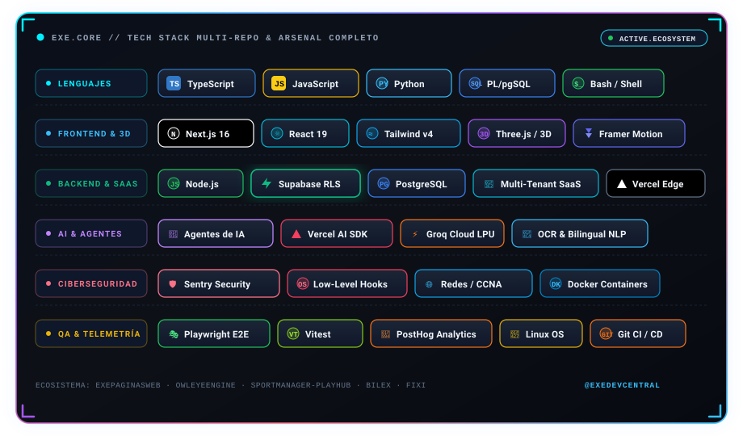

  

---

### 💼 Propuesta de Valor & Soluciones para Empresas

Ingeniero de software y creador de plataformas digitales enfocado en **arquitecturas web escalables, sistemas SaaS multi-tenant y aplicaciones de alto rendimiento**. Diseño y despliego soluciones de software completas que automatizan procesos críticos, resuelven cuellos de botella operativos y maximizan la rentabilidad corporativa.

- 🏢 **Sistemas SaaS & Cloud a Medida:** Creación de plataformas B2B de principio a fin utilizando **Next.js 16**, **TypeScript**, **React 19** y bases de datos **PostgreSQL** con políticas **Row Level Security (RLS)** de estricto aislamiento por cliente (ej. [ExePaginasWeb](https://exepaginasweb.com) y *SportManager*).
- ⚡ **Performance de Élite & Core Web Vitals:** Optimización de infraestructura frontend y edge para lograr cargas ultrarrápidas (LCP sub-1.5s, 0 CLS, code-splitting inteligente y 60-120 FPS).
- 🤖 **Agentes de IA & Automatización de Flujos:** Integración de modelos LLM con **Groq Cloud LPU** y **Vercel AI SDK**, chatbots inteligentes con acceso a bases de datos y extracción automatizada de documentos (*OCR & Bilingual NLP* en Bilex).
- 🛡️ **Ciberseguridad & Resiliencia:** Enfoque defensivo con monitoreo de bajo nivel, auditoría de eventos en tiempo real, redes gestionadas (CCNA) y protección de datos corporativos (desarrollo de *OwlEyeEngine*).
- 🚀 **Propiedad Total y Sin Comisiones:** Entrega de código 100% propietario con control absoluto para la empresa, evitando comisiones cautivas y limitaciones de plataformas cerradas.

---

<h2 align="center">🛠️ Stack & Tecnologías</h2>

  

---

<h2 align="center">📊 GitHub Analytics</h2>

  
  

 

  

---

<h2 align="center">🐍 Serpiente de Contribuciones</h2>

  <picture>
    <source media="(prefers-color-scheme: dark)" srcset="https://raw.githubusercontent.com/ExeDevCentral/ExeDevCentral/gh-pages/output/github-contribution-grid-snake-dark.svg" />
    <source media="(prefers-color-scheme: light)" srcset="https://raw.githubusercontent.com/ExeDevCentral/ExeDevCentral/gh-pages/output/github-contribution-grid-snake.svg" />
    
  </picture>

---

<h2 align="center">📫 Contacto Profesional</h2>

  
  
  
  

  
    
  

